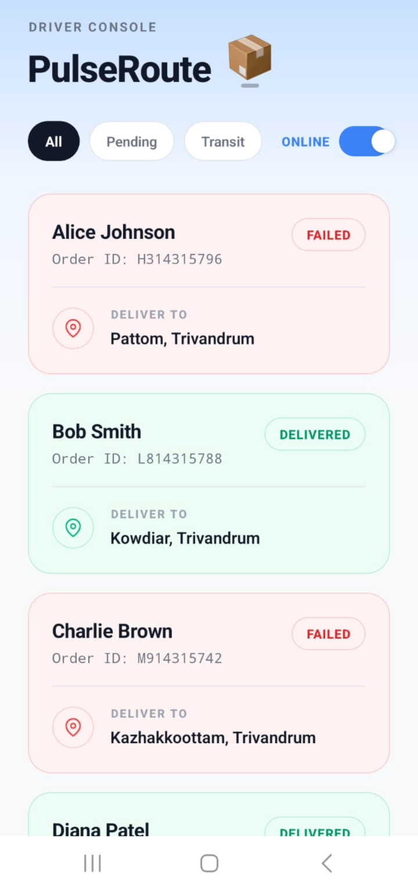
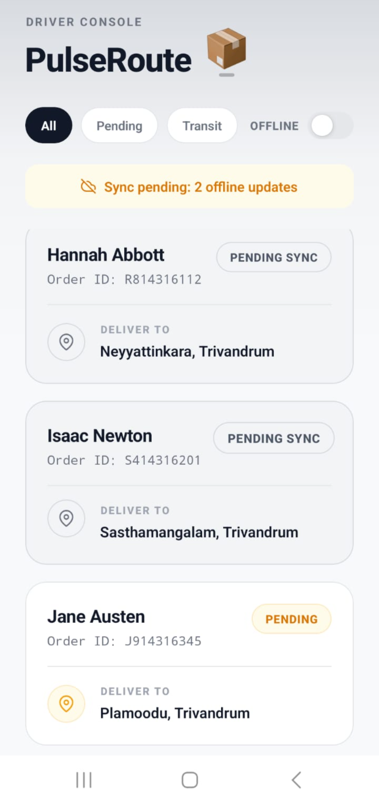
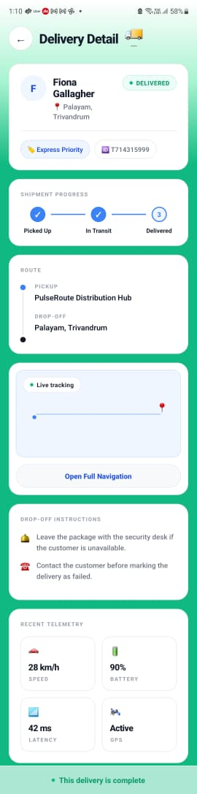

# PulseRoute 🚚

An offline-first last-mile delivery application built with React Native and Expo.

## Overview

PulseRoute is designed for delivery couriers operating in environments with unreliable network connectivity. The application allows delivery updates to be recorded locally, queued during offline periods, and automatically synchronized when connectivity is restored.

---

## Features

### Delivery Dashboard

* View assigned deliveries
* Track delivery status
* Priority indicators
* Offline/Online network simulation
* Swipe gestures for delivery actions

### Offline-First Synchronization

* Local persistence of delivery data
* Offline mutation queue
* Pending Sync status tracking
* Automatic synchronization upon reconnecting

### Delivery Detail Screen

* Delivery information
* Drop-off instructions
* Telemetry monitoring
* Navigation placeholder

### Telemetry Simulation

* Generates tracking events every 500ms
* Simulates GPS coordinates
* Simulates device metrics
* Live telemetry feed

---

## Screenshots

## Screenshots

<p align="center">
  
  
</p>

<p align="center">
  <em>Dashboard View</em> &nbsp;&nbsp;&nbsp;&nbsp;&nbsp;&nbsp;&nbsp;&nbsp;&nbsp;&nbsp;&nbsp;&nbsp;&nbsp;&nbsp;&nbsp;&nbsp;&nbsp;&nbsp;&nbsp;&nbsp;&nbsp;&nbsp;
  <em>Offline Queue & Pending Sync</em>
</p>

<h3>Delivery Detail</h3>

<p align="center">
  
</p>

---

## Technology Stack

| Category    | Technology                   |
| ----------- | ---------------------------- |
| Framework   | React Native                 |
| Platform    | Expo SDK 54                  |
| Language    | TypeScript                   |
| Navigation  | React Navigation             |
| Persistence | AsyncStorage                 |
| Gestures    | React Native Gesture Handler |

---

## Installation

### Clone Repository

```bash
git clone <repository-url>
cd PulseRoute
```

### Install Dependencies

```bash
npm install
```

### Run Development Server

```bash
npx expo start
```

### Android Device

1. Install Expo Go.
2. Connect device to the same network.
3. Scan the generated QR code.

### Android Emulator

```bash
npm run android
```

### iOS Simulator

```bash
npm run ios
```

---

## Project Architecture

```text
DashboardScreen
├── Delivery List
├── Offline Queue
├── Telemetry Generator
└── Sync Engine

DetailScreen
├── Delivery Details
├── Drop-off Instructions
├── Map Placeholder
└── Telemetry Feed
```

---

# Design Decisions Document

## 1. Offline-First Architecture

PulseRoute is designed to remain fully functional even in environments with unreliable or unavailable network connectivity. Delivery personnel frequently operate in areas where internet access may be intermittent, making an uninterrupted workflow essential.

To support this, all delivery actions are recorded locally before any synchronization is attempted. When the application is offline, updates are stored in a local synchronization queue and marked as Pending Sync.

Once connectivity is restored, queued actions are processed automatically and synchronized in sequence. This approach ensures data consistency, preserves user actions, and provides a reliable experience regardless of network conditions.

---

## 2. Local Storage Strategy

### Selected Technology

AsyncStorage

### Reasoning

AsyncStorage was selected to provide persistent local storage for:

* Delivery data
* Synchronization queue
* Network mode state

This allows the application to recover its state after restarts and maintain offline operations without requiring server connectivity.

---

## 3. State Management Architecture

### Selected Approach

React Hooks

The application uses:

* useState
* useEffect
* useCallback

The state surface of the application is relatively small and localized, making React Hooks a lightweight and maintainable solution without introducing additional state management libraries.

---

## 4. Synchronization Engine

When operating offline:

1. Delivery actions are recorded locally.
2. Items are marked as Pending Sync.
3. Mutations are stored in a synchronization queue.

When connectivity returns:

1. The queue is processed sequentially.
2. Pending operations are applied.
3. Synchronization indicators are removed.
4. Local state is updated.

This simulates a production-style offline synchronization workflow commonly used in logistics applications.

---

## 5. Performance Optimization

Several measures were implemented to maintain responsiveness:

### FlatList Virtualization

FlatList was used for efficient rendering of delivery records and to avoid unnecessary memory usage.

### Memoized Components

React.memo was used to prevent unnecessary re-renders of delivery cards.

### Stable Callbacks

useCallback was used to avoid recreating frequently passed functions during re-renders.

### Controlled Telemetry History

Telemetry history is capped to a fixed-size buffer, preventing unbounded memory growth.

---

## 6. UI Thread Optimization During Telemetry Ingestion

The telemetry generator continuously produces tracking events at fixed intervals.

To ensure the UI remains responsive:

* Telemetry payloads remain lightweight
* Telemetry history is capped
* Interval cleanup prevents memory leaks
* FlatList virtualization reduces rendering overhead
* State updates are limited to affected components

These measures help maintain smooth user interactions while telemetry events are continuously generated.

---

## Author

Developed by Uttara Praveen.
